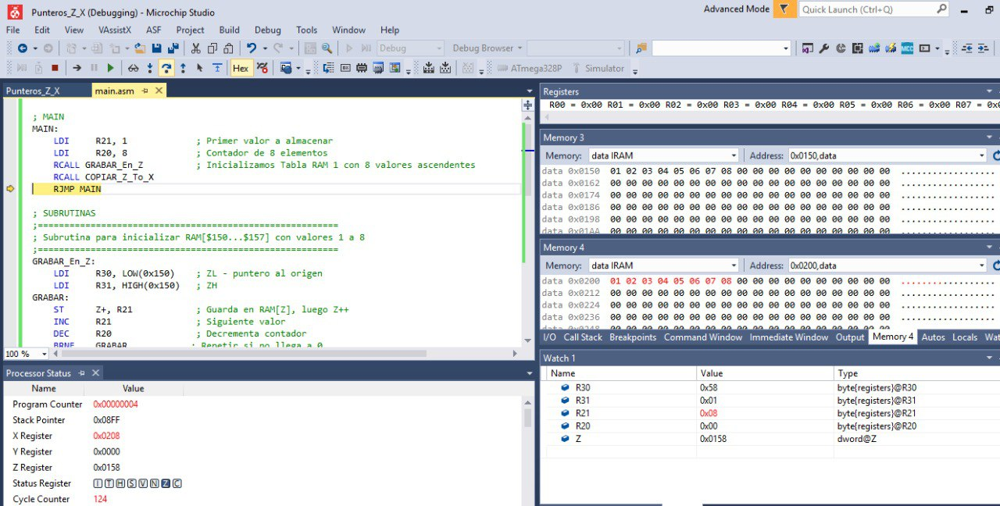

# MUEVE_TABLA - Subrutina en Ensamblador AVR

## Descripción

Este proyecto contiene un programa en lenguaje ensamblador AVR que realiza dos tareas principales utilizando subrutinas:

1. **Inicializa una tabla en la RAM** desde la dirección `$150` hasta `$157` con valores ascendentes del 1 al 8.
2. **Copia los valores de esa tabla** a otra ubicación en la RAM, desde `$200` hasta `$207`.

El código El código ha sido implementado y simulado en el entorno de desarrollo Microchip Studio.
---

## Estructura del Código

### `MAIN`

- Llama a `GRABAR_En_Z` para inicializar los datos en RAM.
- Llama a `COPIAR_Z_To_X` para copiar esos datos a otra ubicación.
- Luego hace un salto incondicional a `MAIN`, reiniciando el proceso indefinidamente.

### `GRABAR_En_Z`

- Usa el registro `Z` como puntero (R30:R31) para escribir en RAM desde la dirección `$150`.
- Escribe 8 valores (del 1 al 8) secuencialmente.

### `COPIAR_Z_To_X`

- Usa `Z` para leer desde `$150` y `X` (R26:R27) para escribir en `$200`.
- Copia los mismos 8 valores de una tabla a otra.

---

## Requisitos

- Microcontrolador AVR compatible (por ejemplo, ATmega328P).
- Entorno de desarrollo: Microchip Studio
- Herramienta de carga (si se usa en hardware real): AVRDUDE, USBasp, etc.

---

## Cómo Usarlo

1. Cargar el archivo en tu entorno AVR.
2. Compilar y subir al microcontrolador.
3. Monitorea las direcciones de memoria desde `$150` a `$157` y desde `$200` a `$207` para ver la transferencia de datos.

---

## Evidencia de Simulación

La siguiente imagen muestra la ejecución del programa en el simulador de **Microchip Studio**, verificando la copia correcta de los datos en RAM:

---
## Autor

Luis David Barahona  
📅 Mayo 2025  
🔧 Estado: **FUNCIONA**

---

## Licencia

Este código se proporciona con fines educativos y puede ser modificado y distribuido libremente.
